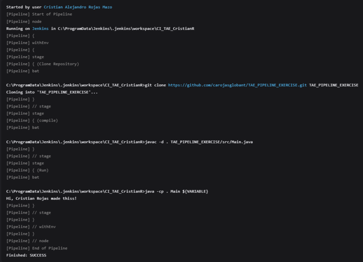
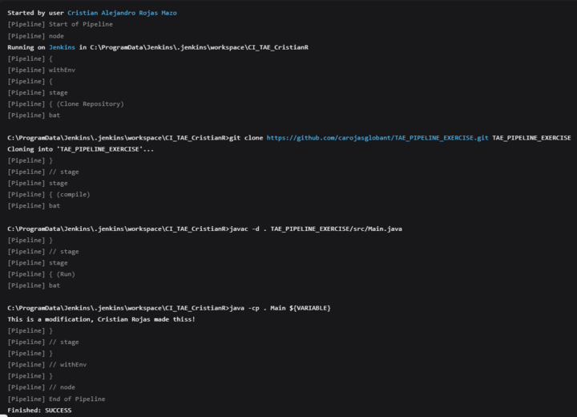
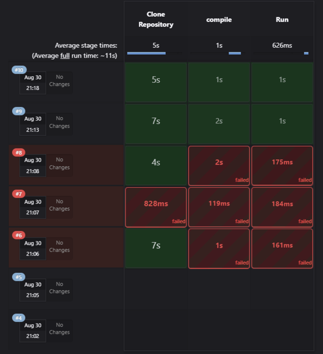
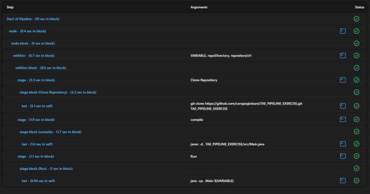

# How to use this repository?

1. Create a new Jenkins job: 
From the Jenkins dashboard, click on "New Item" to create a new Jenkins job. 
Enter a suitable name for the job and select "pipeline". 
Click on "OK" to proceed. 

2. Configure the Jenkins job: 
In the job configuration page, scroll down to the "GitHub project" section.
Check the box. 
Provide this Git repository URL. 
Next scroll down to the "GitHub hook trigger for GITScm polling" section.
Check the box. 

3. Create the script: Scroll down to the pipeline definition and select "Pipeline script". 
Copy and paste the script called jenkins_script from this repo into the text-field. 
Save the configuration. 
4. Build the Jenkins job: 
From the Jenkins dashboard, locate and click on the job you created.
Click on "Build Now" to start the job.
Jenkins will clone the Git repository, execute the build steps, and print the console messages with the environment variables.

## First result

As you may see the message: Hi, Cristian Rojas made thiss! is displayed
## Second result

After the code modification the message: This is a modification, Cristian Rojas made thiss! is displayed
## Builds

## Last pipeline steps
